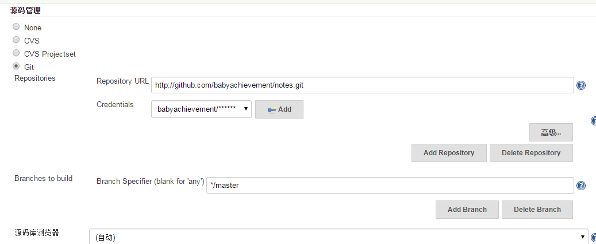

#在ubuntu上安装jenkins并安装git插件

##安装jenkins

    wget -q -O - http://pkg.jenkins-ci.org/debian/jenkins-ci.org.key | sudo apt-key add -
    sudo sh -c 'echo debhttp://pkg.jenkins-ci.org/debian binary/ >/etc/apt/sources.list.d/jenkins.list'
    sudo apt-get update
    sudo apt-get install jenkins

为什么不用jenkins.war包，之前试了一下，在ubuntu上安装jenkins再装git插件会出现bug，搜了半天也没弄明白是什么原因。

##为jenkins安装git插件
在系统配置->插件管理->可用插件 中搜到git plugin安装

##jenkins执行配置示例

