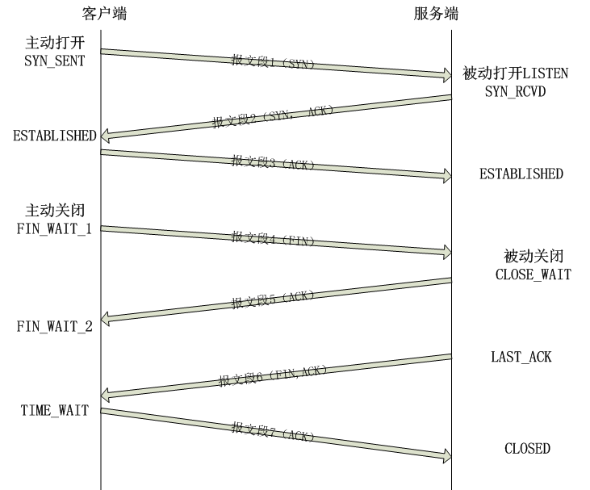

TIME_WAIT状态
=========================================

客户端连接在收到服务器的结束报文段之后，并没有直接进入CLOSED状态，而是转移到TIME_WAIT状态。在这个状态，客户端连接要等待一段长为2MSL(Maximum Segment Life,报文段最大生存时间）的时间，才能完全关闭。MSL是TCP报文段在网络中的最大生存时间，标准文档RFC 1122建议值为2min.

TIME_WAIT状态存在的原因有两点：
	* 可靠地终止TCP连接
	* 保证让迟来的TCP报文段有足够的时间呗识别并丢弃

第一个原因的理解：假设图中确认服务器结束报文段6的TCP报文段7丢失，那么服务器将重发结束报文段。因此客户端需要停留在某个状态以处理重复收到的结束报文段（即向服务器发送确认报文段）。否则，客户端将以复位报文段来回应服务器，服务器则认为这是一个错误，因为它期望的是一个像TCP报文段7那样的确认报文段。

在Linux系统上，一个TCP端口不能被同时打开多次（两次及以上）。当一个TCP连接处于TIME_WAIT状态时，我们将无法立即使用该连接占用着的端口来建立一个新连接。反过来思考，如果不存在TIME_WAIT状态，则应用程序能够立即建立一个和刚关闭的连接相似的连接（相似指的是IP地址和端口号相同）。这个新的和原来相似的连接被称为原来连接的化身（incarnation）。新的化身可能接收到属于原来的连接的TCP报文段（迟到的报文段），这显然是不该发生的。这就是TIME_WAIT存在的第二个原因。

##为什么是TIME_WAIT要坚持2MSL时间呢？

TCP报文段的最大生存时间是MSL,所以坚持2MSL能确保网络上两个传输方向上尚未被接收到的、迟到的TCP报文段都已经消失。因此，一个连接的新的化身可以在2MSL时间之后安全地建立。
