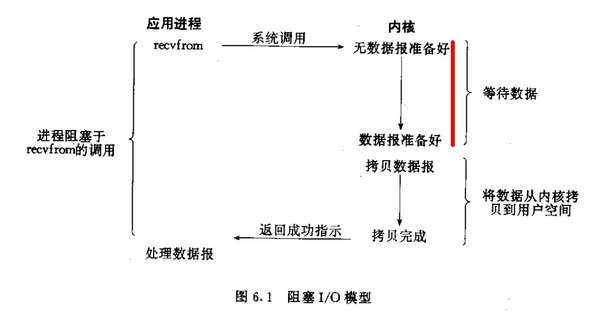
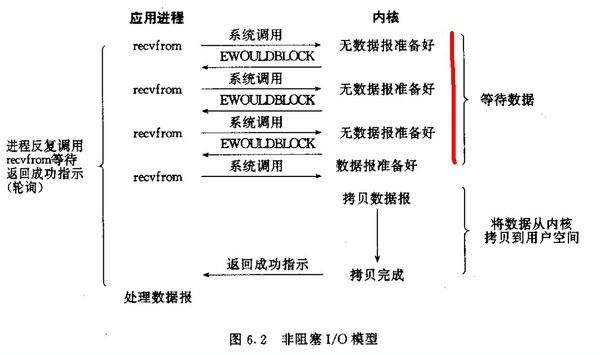
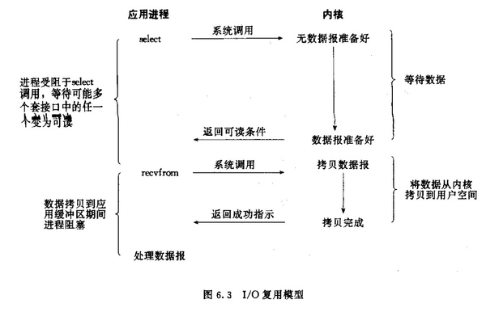
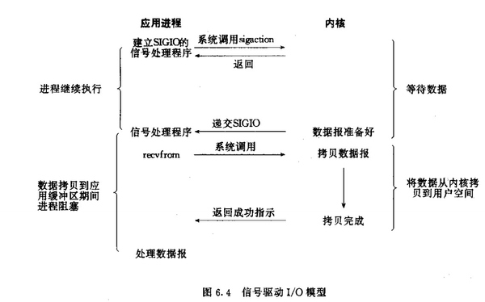

#服务器模型

##C/S模型
默认情况下，所有套接字都是阻塞的。怎么理解？先理解这么个流程，一个输入操作通常包括两个不同阶段：
1. 等待数据准备好；
2. 从内核向进程复制数据。#P2P模型

对于一个套接字上的输入操作，第一步通常涉及等待数据从网络中到达。当所有等待分组到达时，它被复制到内核中的某个缓冲区。第二步就是把数据从内核缓冲区复制到应用程序缓冲区。 好，下面我们以阻塞套接字的recvfrom的的调用图来说明阻塞

标红的这部分过程就是阻塞，直到阻塞结束recvfrom才能返回。

##非阻塞式I/O
以下这句话很重要：进程把一个套接字设置成非阻塞是在通知内核，当所请求的I/O操作非得把本进程投入睡眠才能完成时，不要把进程投入睡眠，而是返回一个错误。看看非阻塞的套接字的recvfrom操作如何进行

##I/O多路复用 
虽然I/O多路复用的函数也是阻塞的，但是其与以上两种还是有不同的，I/O多路复用是阻塞在select，epoll这样的系统调用之上，而没有阻塞在真正的I/O系统调用如recvfrom之上。如图

'

##信号驱动式I/O 
用的很少，就不做讲解了。直接上图

'
