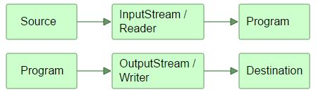

# Java IO Overview

## Input 和 Output——源和目的

Java IO包中最典型的源和目的：

* 文件
* 管道
* 网络连接
* 内存中缓存（例如：数组）
* 标准输入、标准输出和标准错误

## 流(Stream)

IO流是Java IO中一个核心概念。一个流是一个概念上的数据流（flow）。可以从一个流中读数据或者将数据写入流。一个流连接着一个数据源或者数据目的短。Java IO中的流可以是基于字节的也可以是基于字符的。

###输入流(InputStream)，输出流(OutputStream)，Reader和Writer

从源中读数据的程序需要一个InputStream或者一个Reader。将数据写入目的端的程序需要一个OutputStream或者一Writer。

## Java IO 目的和特点

Java IO包含了许多InputStream,OutputStream，Reader和Writer的子类。所有这些子类因为不同的目的而存在。主要目的有：

* 文件访问
* 网络访问
* 内存中的缓存访问
* 缓存
* 过滤
* 解析
* 读取和写入文本
* 读取和写入基本类型数据（long，int等）
* 读取和写入对象

## Java IO综述

<table style="border:1px solid black; border-collapse:collapse;">
	<thead>
	<tr>
		<td rowspan="2"></td>
		<td colspan="2">基于字节</td>
		<td colspan="2">基于字符</td>
	</tr>
	<tr>
		<td>输入</td>
		<td>输出</td>
		<td>输入</td>
		<td>输出</td>
	</tr>
	</thead>
	<tbody>
		<tr>
			<td>Basic</td>
			<td>InputStream</td>
			<td>OutputStream</td>
			<td>InputStreamReader</td>
			<td>OutputStreamWriter</td>
		</tr>
		<tr>
			<td>Arrays</td>
			<td>ByteArrayInputStream</td>
			<td>ByteArrayOutputStream</td>
			<td>CharArrayReader</td>
			<td>CharArrayWriter</td>
		</tr>
		<tr>
			<td>Files</td>
			<td>FileInputStream,RandomAccessFile</td>
			<td>FileOutputStream,RandomAccessFile</td>
			<td>FileReader</td>
			<td>FileWriter</td>
		</tr>
		<tr>
			<td>Pipes</td>
			<td>PipedInputStream</td>
			<td>PipedOutputStream</td>
			<td>PipedReader</td>
			<td>PipedWriter</td>
		</tr>
		<tr>
			<td>Buffering</td>
			<td>BufferedInputStream</td>
			<td>BufferedOutputStream</td>
			<td>BufferedReader</td>
			<td>BufferedWriter</td>
		</tr>
		<tr>
			<td>Parsing</td>
			<td>PushbackInputStream,StreamTokenizer</td>
			<td></td>
			<td>PushbackReader,LineNumberReader</td>
			<td></td>
		</tr>
		<tr>
			<td>String</td>
			<td></td>
			<td></td>
			<td>StringReader</td>
			<td>StringWriter</td>
		</tr>
		<tr>
			<td>Data</td>
			<td>DataInputStream</td>
			<td>DataOutputStream</td>
			<td></td>
			<td></td>
		</tr>
		<tr>
			<td>Data - Formatted</td>
			<td></td>
			<td>PrintStream</td>
			<td></td>
			<td>PrintWriter</td>
		</tr>
		<tr>
			<td>Objects</td>
			<td>ObjectInputStream</td>
			<td>ObjectOutputStream</td>
			<td></td>
			<td></td>
		</tr>
		<tr>
			<td>Utilities</td>
			<td>SequenceInputStream</td>
			<td></td>
			<td></td>
			<td></td>
		</tr>
	</tbody>
</table>