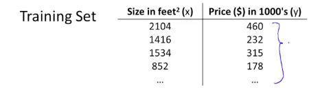
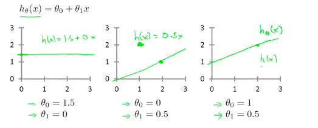

# 代价函数(Cost function)

在线性回归中我们有这么一个函数：hθ(x) = θ0 + θ1x

当$\theta_i$取不同值时:

在监督学习中，我们有一个训练集，我们要做的就是让假设函数尽量的拟合训练集，那如何得到θi的值呢？

我们的想法是取$θ_i$时，要使得h(x)与y的值尽量接近

$$min_{\theta_0,\theta_1}$$ { $\sum_{i=1}^m$ [$$h_{\theta}$$(x)-y]$$^2$$ }

这里m表示训练集样本个数，为了方便计算，我们会将上边的式子除以2m。

我们将代价函数，记作：

J($\theta_0$, $\theta_1$) = $\frac{1}{2m}$$\sum_{i=1}^m$ [$$h_{\theta}$$(x$_i$)-y$_i$]$$^2$$

这里的代价函数也称作平方误差函数（square error function），平方误差函数是线性回归常用的代价函数，还有其他代价函数，我们一会会介绍。接下来，我们要做的就是求J($\theta_0$, $\theta_1$) 最小值。