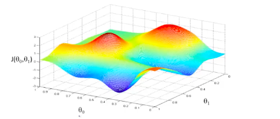
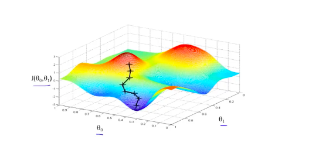
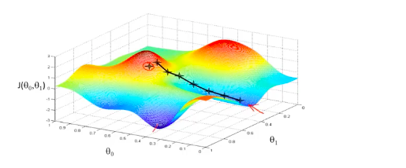

# 2.5 梯度下降


给定函数J($\theta_0, \theta_1$),怎么最小化J($\theta_0, \theta_1$)?

方法：

* 从起始值$\theta_0, \theta_1$开始，通常将$\theta_0=0,\theta_1=0$ 作为起始值
* 持续变更$\theta_0, \theta_1$以减少J($\theta_0, \theta_1$)，直到达到最小值或局部最小值





从图上选一个起始点，沿着下降最快的方向：




从另一个起始点出发，我们可能得到第二个局部最优解：





梯度下降的算法：

```
repeat until convergence {
	
```

​		$\theta_j$ := $\theta_j$ - $\alpha$ $$\frac{\partial}{\partial \theta_j}$$J($\theta_0$, $\theta_1$)       (for j=0 and j=1)

```
}
```

$\alpha$ : 称作学习率(learning rate),控制学习的速度，即梯度下降时迈出多大的步子。


这里有个细节需要注意，要同时更新$\theta_0$和 $\theta_1$，如下所示：

​	temp0 :=  $\theta_0$ -  $\alpha$  $$\frac{\partial}{\partial \theta_0}$$J($\theta_0$, $\theta_1$)

​	temp1 :=  $\theta_1$ -  $\alpha$  $$\frac{\partial}{\partial \theta_1}$$J($\theta_0$, $\theta_1$)

​	$\theta_0$ := temp0

​	$\theta_1$ := temp1


而不是交替更新，下面的方法是错误的：

​	temp0 :=  $\theta_0$ -  $\alpha$  $$\frac{\partial}{\partial \theta_0}$$J($\theta_0$, $\theta_1$)

​	$\theta_0$ := temp0

​	temp1 :=  $\theta_1$ -  $\alpha$  $$\frac{\partial}{\partial \theta_1}$$J($\theta_0$, $\theta_1$)

​	$\theta_1$ := temp1


$$\alpha$$永远是一个正数，如果$$\alpha$$ 太小会导致梯度下降太慢；如果$$\alpha$$ 太大则会导致梯度下降无法覆盖最小值，可能无法收敛甚至发散。

梯度下降能够覆盖局部最小值，即使使用固定的学习速率：

$\theta_j$ := $\theta_j$ - $\alpha$ $$\frac{\partial}{\partial \theta_j}$$J($\theta_0$, $\theta_1$) 

因为当$$\theta_j$$ 在逐渐接近最小值时，梯度下降会自动移动的步长会更小，因为导数值会更小，所以无需随着时间调整$$\alpha$$。

把梯度下降和代价函数整合以后：

$\theta_0$  := $\theta_0$ - $$\alpha$$ . $\frac{1}{m}$$\sum_{i=1}^m$ [$$h_{\theta}$$(x$_i$)-y$_i$]

$\theta_1$  := $\theta_1$ -  $$\alpha$$ . $\frac{1}{m}$$\sum_{i=1}^m$ [$$h_{\theta}$$(x$_i$)-y$_i$]. x$$_i$$


这里的梯度下降使用了所有的样本数据，我们称这样的梯度下降为Batch Gradient Descent(批梯度下降)。