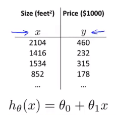

# 4.1 多特征

当我们有一个特征时，我们的假设是这样的：

而当我们的特征不止房屋面积时，我们还有卧室数量，楼层数量和房屋年龄等特征：

我们使用xi (i=1,2,3,4)来表示不同的特征变量

n = 特征数量

x(i)  = 第i个训练样本输入

x(i)j = 第i个训练样本的第j个特征的值

如上表中n=4，
$$
x^{(2)} =\begin{matrix}1416 \\ 3 \\ 2 \\ 40 \end{matrix}
$$

x(2)3 = 2。

我们的假设：
$$
h_{\theta}(x) = \theta_0 + \theta_1x_1 +\theta_2x_2 +... +\theta_nx_n
$$

定义x0 = 1简写：
$$
x = \begin{matrix} x_0 \\ x_1 \\ .\\.\\. \\ x_n \end{matrix}

\in {\rm I\!R}^{n+1} 
$$

$$
\theta = \begin{matrix} \theta_0 \\ \theta_1 \\ .\\.\\. \\ \theta_n \end{matrix}

\in {\rm I\!R}^{n+1}
$$

$$
h_{\theta}(x) = \theta^Tx
$$
