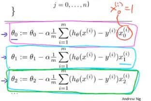

# 4.2 多元梯度下降

假设：
$$
h_{\theta}(x) = \theta_0 + \theta_1x_1 +\theta_2x_2 +... +\theta_nx_n
$$
参数：
$$
\theta_0,\theta_1,\theta_2...\theta_n
$$

损失函数：
$$
J(\theta_0,\theta_1,...,\theta_n) = \frac{1}{2m}\sum_{i=1}^m( h_\theta (x^{(i)})-y^{(i)})^2
$$

梯度下降：

Repeat {
$$
\theta_j := \theta_j - \alpha \frac{\partial}{\partial \theta_j}J(\theta_0,\theta_1,...,\theta_n)
$$
​																			(simultaneously update for every j = 0,...,n)

}

实际计算后为：

Repeat {
$$
\theta_j := \theta_j - \alpha \frac{1}{m}\sum_{i=1}^{m}((h_{\theta}(x^{(i)}) - y^{(i)})x_{j}^{(i)})
$$
​																			(simultaneously update θ for j=0,1,...n)

}

比如有两个特征，参数更新过程如下：

