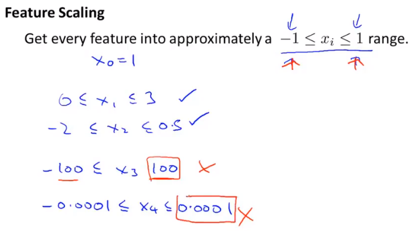

# 4.3 梯度下降中的实际使用技巧：特征缩放(feature scaling)

简单来说，特征缩放就是将特征值缩放到-1到1之间，没有必要非得限制范围必须在-1到1之间，可以稍微大或稍微小，但是不能太大或太小，比如某个特征值的范围超过100，或者小于0.0001。

## 均值归一化

将特征值减去特征值的均值。
$$
x_i := \frac{x_i-u_i}{s_i}
$$
这里:
$$
s_i := max(s_i) - min(s_i)
$$
比如对于第一个表格中的数据s1 = 2104 - 852 = 1252