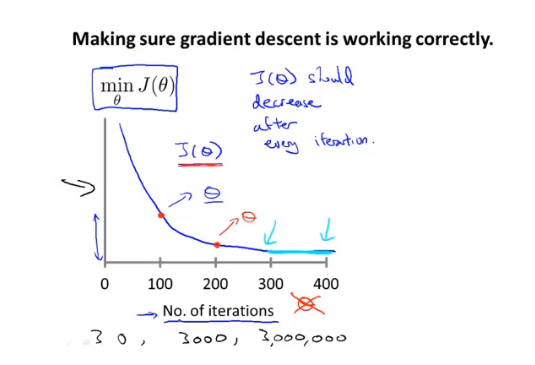
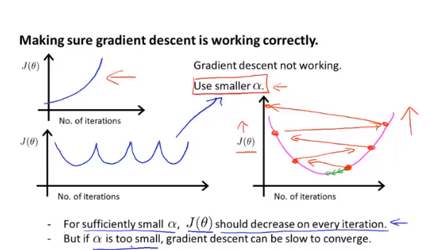

# 4.4 多元梯度下降法II 学习率

* 调试： 如何确保梯度下降正常工作
* 如何选择学习速率α

如果梯度下降工作正常，代价函数的值应该是越来越小的，一个梯度下降是否正常工作的方法是画出代价函数与地带次数的曲线图。

如果代价函数的值越来越大，应该减小学习速率α：

总结：

	- 如果α太小，收敛缓慢
	- 如果α太大，J(θ)可能不会随着每次迭代而减小；甚至不会收敛

为了选择α，可以尝试：

...,0.001,  0.003 , 0.01, 0.03  , 0.1, 0.3   1,...