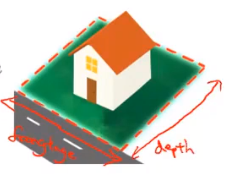

# 4.5 多元线性回归-特征和多项式回归

房价预测：
$$
h_\theta(x) = \theta_0 + \theta_1 * 临街宽度 + \theta_2 * 深度
$$

frontage: 特征1

depth：特征2

我们还可以基于frontage和depth创造新的特征，如面积。

我们可以使用更复杂的函数去拟合图像，并不一定非得使用线性方程，但对于多项式我们同样可以使用线性回归，具体的做法如下：

对于图中的size2, size3 我们将其视为新的特征，这样我们就能使用线性回归的方法去构建预测模型，这个时候，特征缩放就显得尤其有用了。

对于具体选择什么多项式去拟合图像，需要我们对常见的函数图像有一定的了解。