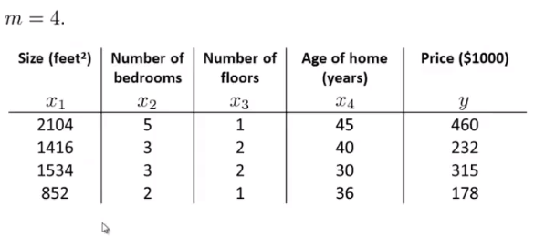
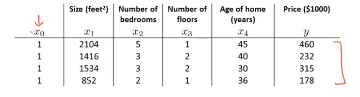
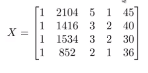
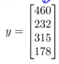

# 4.6 多元线性回归-正规方程

正规方程对于某些线性回归问题能够提供更好地计算参数θ的最优值的方法。

加一列：

构建特征矩阵：

将目标值构建成一个向量

使用投影矩阵可以计算出最优θ:
$$
\theta = (X^TX)^{-1}X^Ty
$$

$$
简单来说就是假设存在\hat\theta 使得A\hat\theta = y，可以写作为A\hat\theta = \overrightarrow{p}+\overrightarrow{e}   (1)
$$

$$
\overrightarrow{p}为\overrightarrow{y}在X的列空间的投影，\overrightarrow{e}为\overrightarrow{y}在X的左零子空间的投影，这样向量\overrightarrow{y} = \overrightarrow{p}+\overrightarrow{e}
$$

然后在（1）式的两边同时左乘以X的转置（$X^T$):
$$
X^TX\hat\theta = X^T\overrightarrow{p}+ X^T\overrightarrow{e}
$$
因为$$\overrightarrow{e}$$在X的左零子空间中，故$$X^T\overrightarrow{e} = 0$$，即：
$$
X^TX\hat\theta = X^T\overrightarrow{p}
$$
两边同时乘以$$(X^TX)^{-1}$$，即可得到最优解$\hat\theta$。

| Gradient Descent           | Normal Equation                                         |
| :------------------------- | :------------------------------------------------------ |
| Need to choose alpha       | No need to choose alpha                                 |
| Needs many iterations      | No need to iterate                                      |
| O (kn^2*k**n*2)            | O (n^3*n*3), need to calculate inverse of X^TX*X**T**X* |
| Works well when n is large | Slow if n is very large                                 |

到底选择梯度下降还是正规方程，要视特征数量而定，因为计算$(X^TX)^{-1}$的复杂度是近似于O($n^3$)的。而且正规方程并不是使用于每个算法的，而梯度下降是。以后我们会学到那些不能适用于正定方程的算法。

对于正规方程：
$$
\theta = (X^TX)^{-1}X^Ty
$$
如果：
$$
(X^TX)^{-1}不可逆怎么办？
$$
什么情况下才不可逆？

- 特征重复

  比如$x_1$ 为房屋的面积平方英尺为单位，$x_2$ 为面积以平方米为单位 $x_1$ = 3.28*3.28*$x_2$ 

- 特征过多($m \le n$)

对于以上问题可以通过删除重复特征，删除不必要特征来解决，还可以使用伪逆来计算，在octave中计算伪逆的命令为pinv。

参考：

[1] [麻省理工公开课 线性代数第16课] (https://www.bilibili.com/video/av15463995/?p=16)