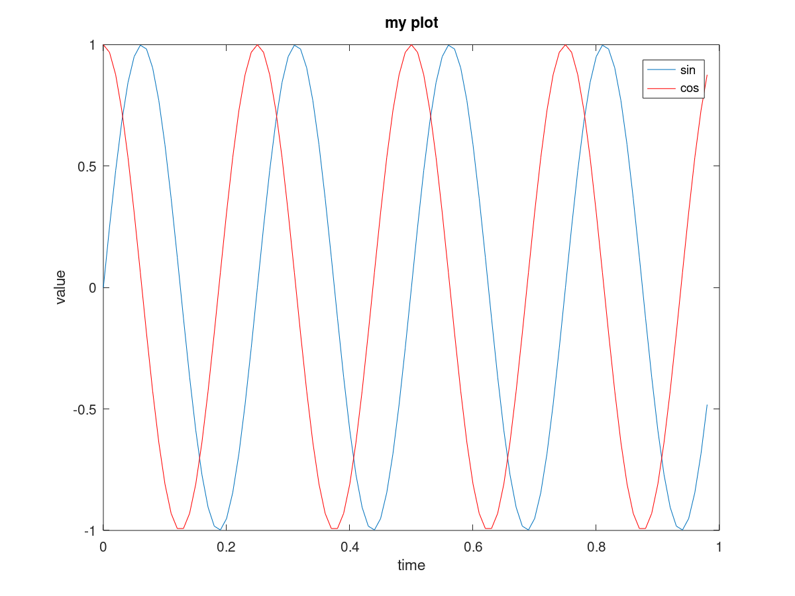
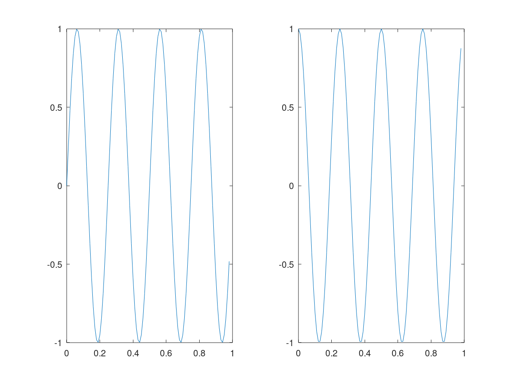
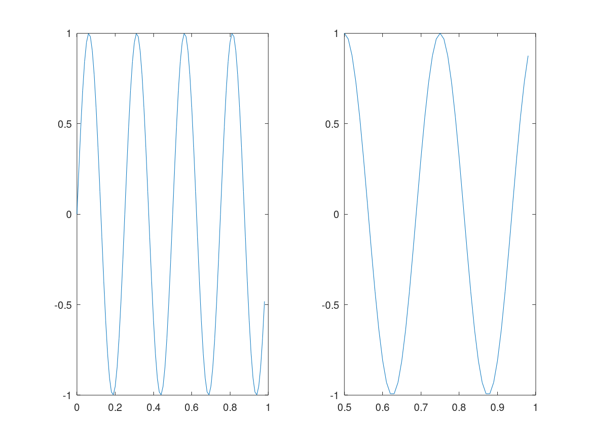
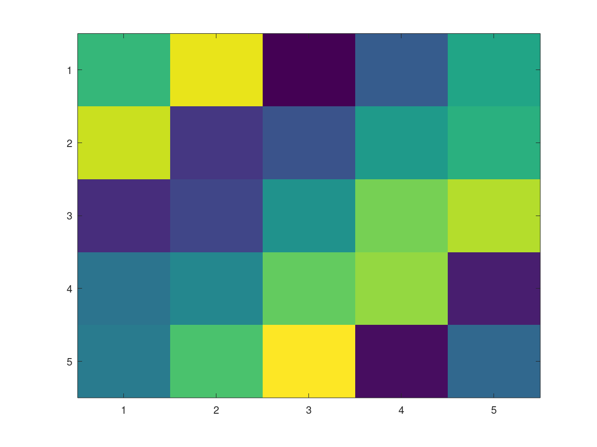
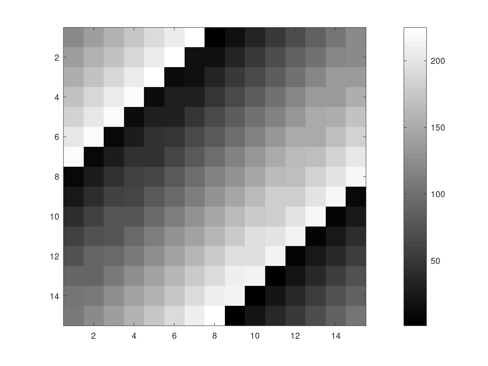
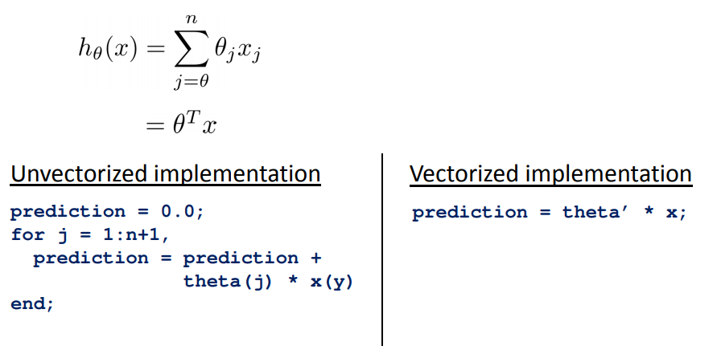
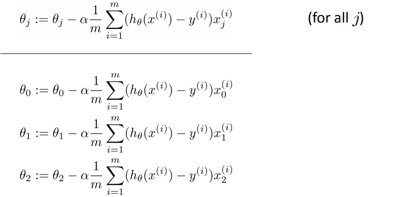

# 5. Octave基本操作


## 1. 数学运算

```
>> 1+2
ans =  3
>> 1*4
ans =  4
>> 1/4
ans =  0.25000
>> 1^3
ans =  1
>> 2^4
ans =  16
>> 5 -3
ans =  2
>> sqrt(16)
ans =  4
```


## 2. 逻辑运算

```
>> 1 || 1
ans = 1
>> 1 == 1
ans = 1
>> 1 ~= 1
ans = 0
>> 1 && 0
ans = 0
```


## 3. 打印

对于复杂的输出，可以使用disp命令

```
>> a = pi;
>> disp(a)
a = 3.1416
>> disp(sprintf('2 decimals: %0.2f', a))
2 decimals: 3.14

>> format long %长格式打印
>> a
a =  3.141592653589793
>> format short %短格式打印
>> a
a =  3.1416
```


## 4. 矩阵

```
>> A = [1 2; 3 4; 5 6] % 构造一个3行2列的矩阵，并将其赋值给A
A =

   1   2
   3   4
   5   6
>> V = [1 2 3] %构造一个行向量，或者一个1行3列的向量
V =

   1   2   3
>> V = [1; 2; 3]
V =

   1
   2
   3
>> V = 1:0.1:2 % 生成从1到2，步长为0.1的数据构成的向量；如果步长不指定，默认步长为1
V =

    1.0000    1.1000    1.2000    1.3000    1.4000    1.5000    1.6000    1.7000    1.8000    1.9000    2.0000
>> V = 1:6
V =

   1   2   3   4   5   6

>> ones(2,3) %使用ones命令生成元素全为1的矩阵，矩阵为2*3
ans =

   1   1   1
   1   1   1
>> w = rand(1,3) % 使用rand生成随机数组成的矩阵，元素值介于0和1之间
w =

   0.095593   0.290247   0.138791
>> randn(1, 3) % 生成高斯分布的矩阵(均值为0，方差为1)
ans =

  -0.63874   1.00968  -0.98650
>> I = eye(4) % 生成单位矩阵
I =

Diagonal Matrix

   1   0   0   0
   0   1   0   0
   0   0   1   0
   0   0   0   1
```


## 5. 查看命令帮助


```
>> help command

>> help eye
```


## 6. 移动数据

```shell
 >> A
A =

   1   2
   3   4
   5   6
>> size(A)
ans =

   3   2
>> size(A, 1)

>> size(A,2)

>> v = [1 2 3 4]

>> length(v)

>> length(A)

>> length([1;2;3;4;5])

>> pwd

>> cd 'C:\Users\ang\Desktop'

>> pwd

>> ls

>> load featuresX.data

>> load priceY.dat

>> load('featuresX.dat')

>> who

>> featuresX

>> size(featuresX)

>> size(prizeY)

>> who

>> whos

>> clear featuresX

>> whos

>> v = priceY(1:10)

>> whos

>> save hello.mat v;

>> clear 

>> loead hello.mat

>> v

>> save hello.txt v -ascci

>> A = [1 2;3 4;5 6]

>> A(3,2)

>> A(2,:) % "："means every element along that row/column

>> A(:,2)

>> A([1 3], :)

>> A(:,2) = [10;11;12]
A =

    1   10
    3   11
    5   12
>> A = [A, [100;101;102]]
A =

     1    10   100
     3    11   101
     5    12   102
     
>> A(:)
ans =

     1
     3
     5
    10
    11
    12
   100
   101
   102
   
>> A = [1 2; 3 4; 5 6]
>> B = [11 12; 13 14; 15 16]

>> C = [A B]
C =

    1    2   11   12
    3    4   13   14
    5    6   15   16

>> C = [A;B] % 分号是把B放到A下面
C =

    1    2
    3    4
    5    6
   11   12
   13   14
   15   16


```


## 7. 数据计算


```
>> A = [1 2; 3 4; 5 6]
>> B = [11 12; 13 14; 15 16]
>> C = [1 1; 2 2]

>> A*C

>> A.*B

>> A .^ 2

>> v = [1; 2; 3]

>> 1 ./ v

>> 1 ./ A

>> log(v)

>> exp(v)

>> abs(v)

>> abs([-1; 2; -3])

>> -v

>> v + ones(length(v))

>> length(v)

>> v + ones(3,1)

>> v +1

>> A'

>> (A')'

>> a = [1 15 2 0.5]

>> val = max(a)

>> [val, ind] = max(a)

>> max(A)

>> a

>> a < 3

>> find(a<3)

>> A = magic(3)

>> [r,c] = find(A>=7)

>> sum(a)

>> prod(a)

>> floor(a)

>> ceil(a)

>> rand(3)

>> max(rand(3), rand(3))

>> A

>> max(A,[], 1)

>> max(A,[], 2)

>> max(A)

>> max(max(A))

>> A(:)

>> max(A(:))

>> A = magic(9)

>> sum(A,1)

>> sum(A,2)

>> A .* eye(9)

>> sum(sum(A.*eye(9)))

>> sum(sum(A.*flipud(eye(9))))


>> eye(8)

>> flipud(eye(8))

>> A = magic(3)

>> pinv(A)

>> temp = pinv(A)

>> temp*A


```


## 8. 画图

```
>> t = [0:0.01:0.98]
>> y1 = sin(2*pi*4*t)
>> plot(t, y1)
>> y2 = cos(2*pi*4*t)
>> plot(t,y2)
>> plot(t,y1)
>> hold on;
>> plot(t, y2,'r');
>> xlabel('time')
>> ylabel('value')
>> legend('sin', 'cos')
>> title('my plot')
>> print -dpng '5_1-1.png'
>> close
```




也可以画多个图

```
>> figure(1);plot(t,y1);
>> figure(2);plot(t,y2);
```


将一个图分成多个格子：

```
>> subplot(1,2,1) %将图分成一行，两列的格子，使用第一个格子
>> plot(t,y1)
>> subplot(1,2,2)
>> plot(t,y2)
```




改变刻度：

```
>> axis([0.5 1 -1 1]) %将x轴刻度调成0.5-1，y轴-1到1
```



清理图像

```
>> clf % clear the current figure window
```

```
>> A=magic(5)
>> imagesc(A)
>> imagesc(A),colorbar,colormap gray

>> imagesc(magic(15)),colorbar,colormap gray %这里的逗号，是命令连接执行的意思
```






## 9. 控制语句


```
>> v = zeros(10,1)
>> for i=1:10,
>	v(i) = 2^i;
>  end;
>> v
v =

      2
      4
      8
     16
     32
     64
    128
    256
    512
   1024


>> indices = 1:10;
>> for i=indices,
> 		disp(i)
>  end;
 1
 2
 3
 4
 5
 6
 7
 8
 9
 10
 
>> i = 1;
>> while i<= 5;
		v(i) = 100;
		i = i+1;
	end;
>> v
v =

    100
    100
    100
    100
    100
     64
    128
    256
    512
   1024

>> i = 1;
>> while true,
		v(i) = 999;
		i = i+1;
		if i == 6,
			break;
		end;
	end;
>> v
v =

    999
    999
    999
    999
    999
     64
    128
    256
    512
   1024
```


if-else

```
>> v(1) = 999;

>> if v(1) == 1,
		disp('The value is one');
	elseif v(1) == 2,
		disp('The value is two');
	else 
		disp('The values is not one or two.')
	end;

```

## 10. 自定义函数

创建函数需要创建名称一个与函数名称相同的文件。

这里在squareThisNumber.m文件中定义函数squareThisNumber。

```
function y = squareThisNumber(x)

y = x^2;
```

当然了，需要octave能够搜索到这个文件，有两个方法可以实现，一是切换到文件所在目录，而是将文件所在目录添加到搜索路径中。

```
>> addpath('/path')
```


octave支持多个返回值的函数：

```
function [y1,y2] = squareAndCubeThisNumber(x)

y1 = x^2;
y2 = x^3;
```


```
>> [a,b] = squareAndCubeThisNumber(2)
a =  4
b =  8
```


定义代价函数：

```matlab
function J = costFunction(X, y, theta)

m = size(X,1);
predictions = X*theta;
sqrError = (predictions-y).^2;
J = 1/(2*m)*sum(sqrError);
```


```matlab
>> X = [1 1;1 2;1 3]
A =

   1   1
   1   2
   1   3

>> y = [1;2;3]
y =

   1
   2
   3

>> theta = [1;2]
theta =

   1
   2

>> theta = [0;1]
theta =

   0
   1

>> costFunction(X,y,theta)
ans = 0
```


## 11 向量化


$$
h_\theta(x) = \sum_{j=0}^n\theta_jx_j = \theta^Tx
$$
没有向量化和向量化的求和方法：




梯度下降同样类似：




$$
\theta  := \theta - \alpha\delta
$$


其中


$$
\delta = \begin{bmatrix}\delta_0  \\ \delta_1\\ \delta_2\\ \end{bmatrix} = \frac{1}{m}\sum_{i=1}^m(h_\theta(x^{(i)}) -y^{(i)})x^{(i)}   \quad; \quad  x^{(i)}是一个向量
$$
