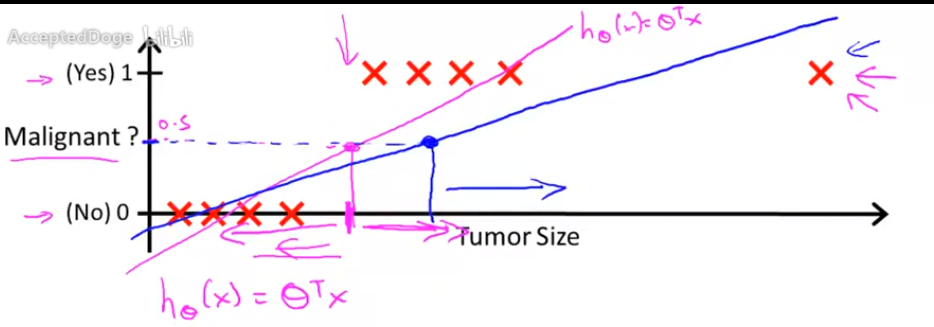
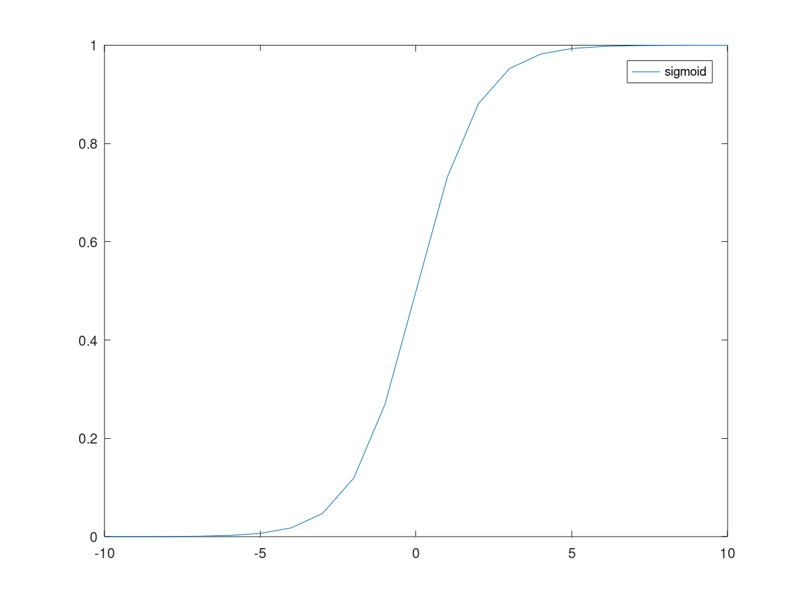
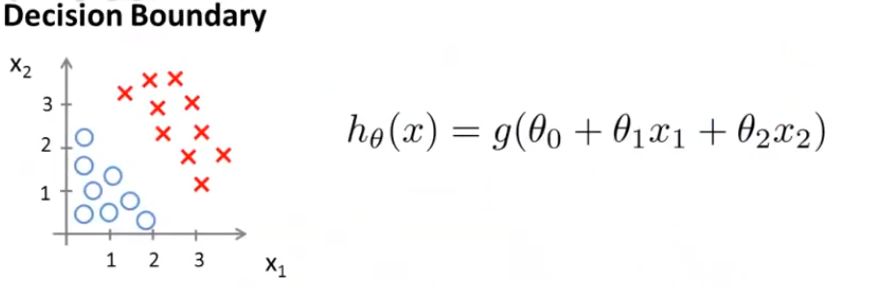
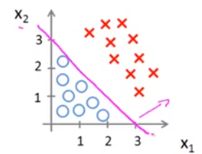
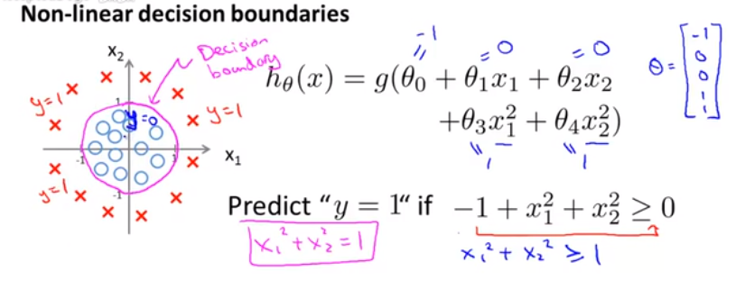
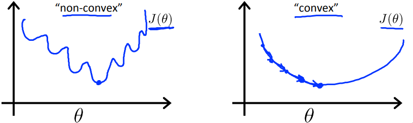
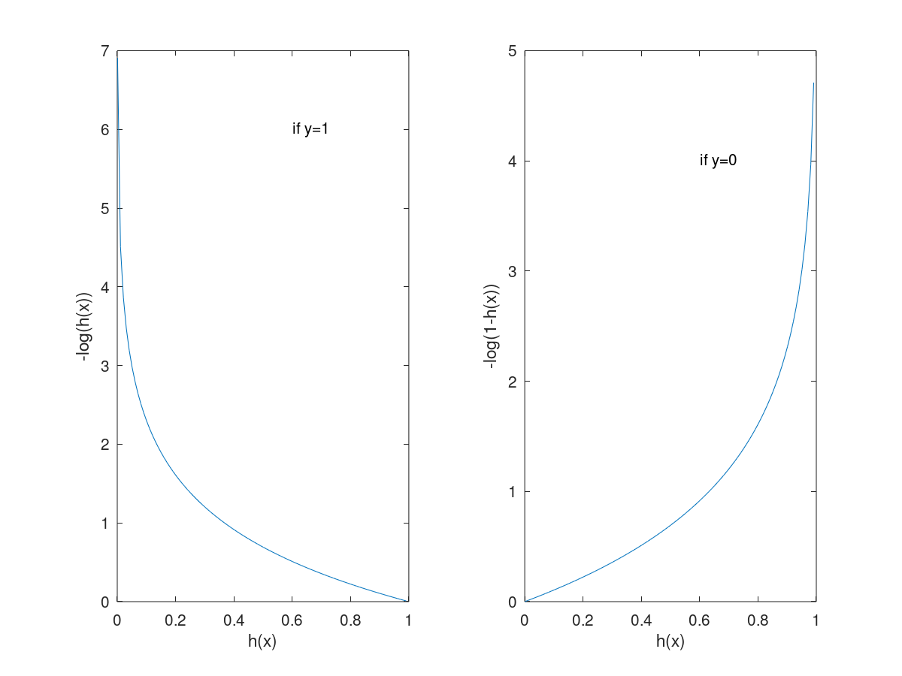

# 分类-逻辑回归

之前介绍的线性回归是针对连续数据的，接下来介绍关于离散数据的机器学习算法。

## 现实中有关分类的例子

邮件： 垃圾/非垃圾邮件？

在线交易：是否欺诈？

肿瘤：恶性还是良性？

$$
y \in \{0 ,1\}     \quad; 0:"负类"，1：“正类”
$$

负类通常表示缺少某种东西，正类表示存在我们想找的东西。这里我们只讨论只有两类（two class or binary classification problem）的问题，以后会介绍有多个分类(multi-classification)的问题。

## 要解决的问题

如上图所示，当没有最右边那个点时，我们使用粉红线（线性回归）去拟合数据，能够很好的区分良性和恶性肿瘤，如大于0.5的为恶性；二加入了最右边的那个点后，再用一条蓝色线去拟合数据，这时候发现分类就有很大问题，恶性肿瘤被划分到良性分类里了。由此我们发现线性回归针对这类问题不再适用，由此引出了逻辑回归。

## Logistic Regression

逻辑回归的预测总会处于0和1之间：
$$
0\leq h_\theta(x) \leq1
$$

## 假设的函数表达式(Hypothesis Representation)

为了使得假设函数的值位于0和1之间：
$$
h_\theta(x) = g(\theta^Tx)
$$
其中g为sigmoid函数：
$$
g(z) = \frac{1}{1+e^{-z}}
$$
合到一起就是：
$$
h_\theta(x) = \frac{1}{1+e^{-{\theta^Tx}}}
$$

sigmoid函数的图像：

$$
h_\theta(x) = 对给定输入x评估其结果y=1的概率
$$

例子：

​	如果$x = \begin{bmatrix}  x_0 \\x_1\end{bmatrix}  = \begin{bmatrix} x_0  \\\ tumorSize\end{bmatrix}$, $h_\theta(x) = 0.7$ 意味着病人有70%的可能患有恶性肿瘤。更正式的表示为：

$h_\theta(x) = P(y=1|x;\theta) = 0.7$；因为分类只有0和1两种情况，$P(y=0|x;\theta) + P(y=1|x;\theta) = 1$，我们可以推导出$P(y=0|x;\theta) = 1 - P(y=1|x;\theta)$ 。

## 决策边界（Decision Boundary)

$$
h_\theta(x)  = g(z) = \frac{1}{1+e^{-z}} = \frac{1}{1+e^{\theta^Tx}}
$$

g(z)函数在 $(-\infty, +\infty)$ 上是单调递增的，如果我们定义当$h_\theta(x) \geq 0.5$时y = 1,$h_\theta(x) <0.5$是y=0，而当z = 0时，g(z) = 0.5,也就是当$ \theta^Tx = 0$时，$h_\theta(x) = 0$。

比如我们取$\theta_0=-3, \theta_1 = 1, \theta_2 = 1$, 当$-3+x_1+x_2 \geq 0$时，预测 y = 1,$-3+x_1+x_2 < 0$时,预测y=0. 我们将直线$-3+x_1+x_2$画到图中：

当样本点$(x_1,x_2)$在直线或直线上面的区域时，$-3+x_1+x_2 \geq 0$,预测结果y=1;当样本点在直线下面的区域中时，预测结果y=0。而$-3+x_1+x_2=0$这条直线我们就称其为决策边界，决策边界将整个平面分成两部分，一片区域预假设函数预测y=1，另一片区域，假设函数预测y=0。

当然也有非线性的决策边界：

如上图，决策边界是一个圆，在圆内的数据我们预测y=0，圆外的我们预测y=1。

决策边界不是训练集的属性，而是假设本身和其参数的属性，只要我们给定了假设的参数，决策边界就确定了，我们不是使用训练集来确定决策边界，而是使用训练集确定拟合参数$\theta$。

## 代价函数（使用训练集拟合参数）
训练集：$\{(x^{(1)},y^{(1)}),(x^{(2)},y^{(2)}),...,(x^{(m)},y^{(m)})\}$
m个样本  $x = \begin{bmatrix} x_0\\x_1\\...\\x_n\end{bmatrix} \quad x_0 = 1, y\in \{0,1\}$

$h_\theta(x) = \frac{1}{1+e^{-\theta^Tx}}$

怎么拟合参数$\theta$呢？
在线性回归中，我们使用最小二乘法作为代价函数拟合参数:
$$
J(\theta) = \frac{1}{m}\sum_{i=1}^m \frac{1}{2}[h_{\theta}(x^{(i)})-y^{(i)}]^2
$$

这里与之前稍微不同的是我们将$\frac{1}{2}$写到求和里了，我们定义Cost函数:
$$
Cost(h_\theta(x^{(i)}),y^{(i)}) = \frac{1}{2}[h_{\theta}(x^{(i)}i)-y^{(i)}]^2
$$

在线性回归中假设函数是线性的，代价函数是凸函数，我们可以保证能够求得全局最小值；而在逻辑回归中，假设函数是sigmoid函数，将其带入上面的代价函数中，生成的是一个非凸函数，显然这个代价函数就不再适用于逻辑回归。

我们在逻辑回归中适用的Cost函数为：

$$
Cost(h_\theta(x),y) = \left \{
\begin{array}{c}
-\log (h_\theta(x)) \quad if \quad y = 1 \\
-\log (1-h_\theta(x)) \quad if \quad y = 0
\end{array}
\right.
$$

如果$y=1, h_\theta(x) = 1$,Cost=0，这是合理的，如果$y = 1, h_\theta(x) -> 0, cost -> \infty$，也就是说，如果我们捕获到y=1的情况下$h_\theta(x)=0$,我们会使用一个非常大的代价惩罚学习算法。

同理，在y=0的情况下$h_\theta(x)=1$，学习算法也会付出一个非常大的代价。

通过这个Cost函数，我们针对逻辑回归也将其转化为凸函数了，逻辑回归的代价函数为：

$$
  J(\theta) = \frac{1}{m}\sum_{i=1}^mCost(h_\theta(x^{(i)}), y^{(i)}), 其中Cost(h_\theta(x),y) = \left \{
  \begin{array}{c}
  -\log (h_\theta(x)) \quad if \quad y = 1 \\
  -\log (1-h_\theta(x)) \quad if \quad y = 0
  \end{array}
  \right.
$$

## 简化代价函数和使用梯度下降求拟合参数

对于逻辑回归的Cost函数，可以将其合并为一个：
$$
Cost(h_\theta(x),y) =-y\log (h_\theta(x)) - (1-y)\log (1-h_\theta(x))
$$

那么逻辑回归的代价函数为：
$$
  J(\theta) = -\frac{1}{m}\sum_{i=1}^m[y^{(i)}\log (h_\theta(x^{(i)})) + (1-y^{(i)})\log (1-h_\theta(x^{(i)}))]
$$

为什么要构造这么一个代价函数？这里涉及到统计学里的最大似然估计，并且该代价函数是凸函数。

有了代价函数以后，同样跟线性回归一样，我们的目标就是求出使得$J(\theta)最小的\theta$

### 梯度下降
Repeat {

$$
\theta_j := \theta_j - \frac{\partial}{\partial\theta_j}J(\theta) = \theta_j - \frac{1}{m}\sum_{i=1}^{m}(h_\theta(x^{(i)}) - y^{(i)})x_j^{(i)}
$$

// 要同步更新所有参数
}

简单推导一下这个导数：

$$
\begin{align}
\frac{\partial}{\partial\theta_j}J(\theta) &= -\frac{1}{m}\sum_{i=1}^m\frac{\partial}{\partial\theta_j}[y^{(i)}\log (h_\theta(x^{(i)})) + (1-y^{(i)})\log (1-h_\theta(x^{(i)}))] \\
&= -\frac{1}{m}\sum_{i=1}^m[y^{(i)}\frac{1}{h_\theta(x^{(i)})}  - (1-y^{(i)})\frac{1}{1-h_\theta(x^{(i)})} ]\frac{\partial h_\theta(x^{(i)})}{\partial\theta_j} \\
&= -\frac{1}{m}\sum_{i=1}^m[y^{(i)}\frac{1}{h_\theta(x^{(i)})}  - (1-y^{(i)})\frac{1}{1-h_\theta(x^{(i)})} ]h_\theta(x^{(i)})(1-h_\theta(x^{(i)}))x_j^{(i)} \\
&= -\frac{1}{m}\sum_{i=1}^m[y^{(i)}-y^{(i)}h_\theta(x^{(i)}) - h_\theta(x^{(i)}) +y^{(i)}h_\theta(x^{(i)})]x_j^{(i)} \\
&= \frac{1}{m}\sum_{i=1}^m[h_\theta(x^{(i)}) -y^{(i)} ]x_j^{(i)}
\end{align}
$$

有部分推导如下：
$$
\begin{align}
\frac{\partial h_\theta(x^{(i)})}{\partial\theta_j} &= \frac{\partial \frac{1}{1+e^{-\theta^Tx}}}{\partial\theta_j} \\
&=\frac{e^{-\theta^Tx}}{(1+e^{-\theta^Tx})^2}\frac{\partial \theta^Tx}{\partial\theta_j} \\
&=\frac{e^{-\theta^Tx}+1-1}{(1+e^{-\theta^Tx})^2}x_j^{(i)} \\
&= [\frac{1}{1+e^{-\theta^Tx}} - \frac{1}{(1+e^{-\theta^Tx})^2}]x_j^{(i)} \\
&= [h_\theta(x^{(i)}) - h_\theta(x^{(i)})^2]x_j^{(i)} \\
&= h_\theta(x^{(i)})(1-h_\theta(x^{(i)}))x_j^{(i)}
\end{align}
$$

最终计算方法：

Repeat {
$$
\theta_j := \theta_j - \alpha \frac{1}{m}\sum_{i=1}^{m}((h_{\theta}(x^{(i)}) - y^{(i)})x_{j}^{(i)})
$$
​																			(simultaneously update θ for j=0,1,...n)

}

可以发现其与线性回归的梯度下降方法相同,只不过假设函数不同而已。
