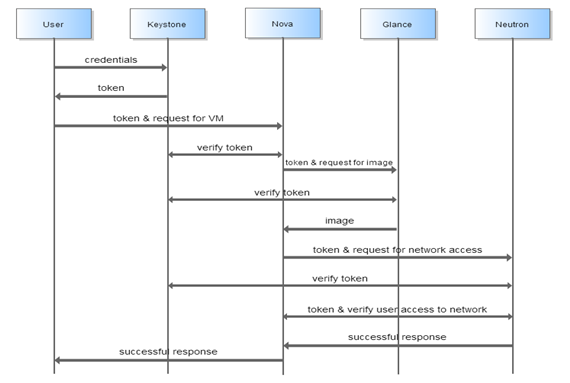

# Keystone V3

## 一些概念

* User:用户，可以是人、服务或者系统
* Tenant：租户，一个人、项目或者组织拥有的资源的合集。一个租户可以拥有很多个用户，这些用户可以根据权限的划分使用租户的资源。
* Role：角色，用于分配操作的权限。角色可以指定给用户，使得用户获得角色相对应的操作权限。
* Token：指的是一个字符串或者彼特值，用来作为访问资源的记号。

## Keystone验证流程

1. 用户向keystone提供用户名密码或者其他身份信息，keystone验证通过后返回一个Token
2. 用户使用该Token访问其他服务，其他服务在接收到用户的请求后会向Keystone请求验证Token以及相应的操作的合法性;

在Keystone V3前，Keystone管理权限以用户为单位，需要为每个用户分配相应的角色。V3中添加了统一管理一组用户的方案。此外，V3之前资源分配的单位为Tenant，无法在Tenant之上对多个Tenant进行统一管理。V3引入了Domain和Group概念。

## V3 新特性

* Tenant改为Project 
* 引入Domain和Group概念

V3利用Domain实现了真正的多租户架构，Domain作为Project容器，用户作为Domain的拥有者，可以在其管理的Domain中创建多个Project、User、Grtoup和Role。

Group是一组User的容器，可以向Group中添加用户，为Group分配角色就相当与为Group中所有的用户分配角色权限。实现了统一管理一组功能相同的用户。

