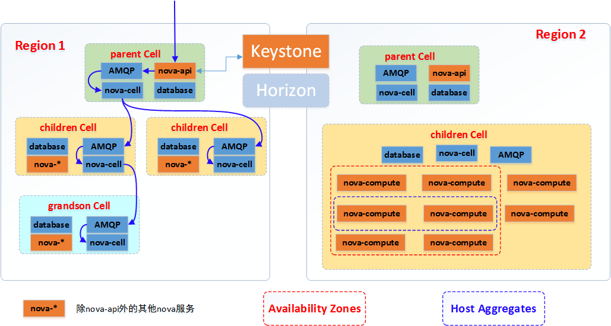
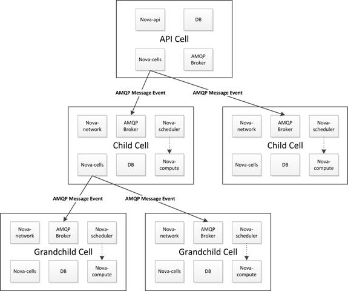

# Zone,Region,Host Aggregates和Cell

## 1. Region

OpenStack支持多Region，Region就是区域，每个区域拥有一套OpenStack，Region之间完全相互隔离，多个区域共享同一个KeyStone和Horizon。

## 2. Cell

Cell的出现主要是为了解决模块瓶颈问题，增强横向扩展和大规模部署的能力。每个cell包含自己的Message Broker和Database。

如上图所示，cell被设计成树形结构，

API Cell包含以下服务：

1. AMQP Broker
2. Database
3. nova-cells
4. nova-api
5. keystone

Child Cell包含以下服务：

1. AMQP Broker
2. Database
3. nova-cells
4. nova-scheduler
5. nova-network
6. nova-compute

全局服务：
* Glance
* Keystone
7. keystone

API Cell主要包含nova-api服务，用于接收用户请求，并将用户请求通过message发送给指定的cell（怎么指定？）;child cell包含除了nova-api之外所有的nova服务，实现具体的nova compute节点服务;API Cell与Child Cell共享Glance服务，且Cells之间通信通过nova-cell服务进行。

Cell调度独立于host调度，在创建新的实例时，首先由nova-cell选择一个Cell(目前是随机的，会增加过滤/权重），当Cell确定之后，实例创建请求会被发送到目标Cell的nova-cell服务，请求会被该Cell调度处理。

Cells内部之间的通信是可插拔的，目前只支持RPC。

## 3. Availability Zone

正如其字面上的意思，Availibility Zone的设计是为了提高容灾性，防止instance同时挂掉，此外也提供了廉价的隔离服务。 Region提供了高级别的隔离机制，
Availability Zone提供了相对低级别的隔离，OpenStack中通过nova-scheduler实现Availability Zone， 创建实例时nova-scheduler会根据nova-compute设置的Availability Zone来调度，

## 4. Aggregate Hosts

 az是一个面向终端客户的概念和能力，而host aggregate是管理员用来根据硬件资源的某一属性来对硬件进行划分的功能，只对管理员可见
其主要功能就是实现根据某一属性来划分物理机，比如按照地理位置，使用固态硬盘的机器，内存超过32G的机器，根据这些指标来构成一个host group。Host aggregate可以用来进一步细分availability zone。az是用户可见的，用户手动的来指定vm运行在哪些host上；Host aggregate是一种更智能的方式，是调度器可见的，影响调度策略的一个表达式。

[1. OpenStack 中的 Nova Cell](http://www.ibm.com/developerworks/cn/cloud/library/1409_zhaojian_openstacknovacell/index.html)
[2. OpenStack多Region实现](http://www.chenshake.com/openstack-region-realize/)
[3. OpenStack重要概念理解（Regions+Cells+Availability Zones+Host Aggregates等)](http://blog.chinaunix.net/uid-20940095-id-4064233.html)
[4. Amazon:Regions and Availability Zones](http://docs.aws.amazon.com/AWSEC2/latest/UserGuide/using-regions-availability-zones.html)
[5. OpenStack Availability Zone和Aggregate Hosts理解](http://blog.chinaunix.net/uid-20940095-id-3875022.html)
